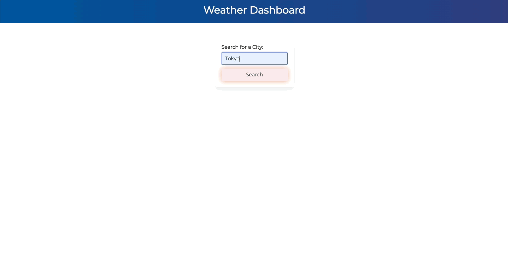

# Weather Dashboard

## Description
This project utilised Third-party APIs, speicifically Open Weather Map API, to build a simple weather dashboard that features dynamically updated HTML and CSS. The application takes in a city input and generates a 5 Day Forecast, through the Open Weather 5 Day / 3 Hour API, for that location, inclusive of temp, windspeed, humidity and corresponding weather condition icons. Local storage was used to store persistent data, so a list of previously searched cities remain displayed on your screen.

The following animation displays the applications functionality:



## Table of Contents

- [Criteria](#criteria)
- [Overview](#overview)
- [Built With](#built-with)
- [Acknowledgements](#acknowledgements)

## Criteria
```
GIVEN a weather dashboard with form inputs
WHEN I search for a city
THEN I am presented with current and future conditions for that city and that city is added to the search history
WHEN I view current weather conditions for that city
THEN I am presented with the city name, the date, an icon representation of weather conditions, the temperature, the humidity, and the wind speed
WHEN I view future weather conditions for that city
THEN I am presented with a 5-day forecast that displays the date, an icon representation of weather conditions, the temperature, the wind speed, and the humidity
WHEN I click on a city in the search history
THEN I am again presented with current and future conditions for that city
```

## Overview
I found this a very challenging yet rewarding project. I struggled alot through Third Party APIs and Local Storage implemenetation, but the trial and error process has taught me a lot going forward. It's not my most aesthetic application and I would like to continue to improve it but the functionality was the primary goal in the completion of this project.
 

### Final Outcome
View my deployed application [here](https://jayabaldwin.github.io/weather-dashboard/)


### Built With
- JavaScript
- HTML
- CSS
- VS Code
- Bulma CSS Library
- Open Weather Map API


## Acknowledgements
- Prateek Nayak (Instructor): assisted me in building a foundation for the project
- [Reid Back](https://github.com/NuclearReid) (Peer): JS and moral support
- Charles (AskBCS): helped me fix an excruciating issue that was effecting the search, beyond greatful
- Chat GPT: assistance in locating errors
- [Great Stack Youtube](https://www.youtube.com/watch?v=MIYQR-Ybrn4&t=10s): understanding API implementation